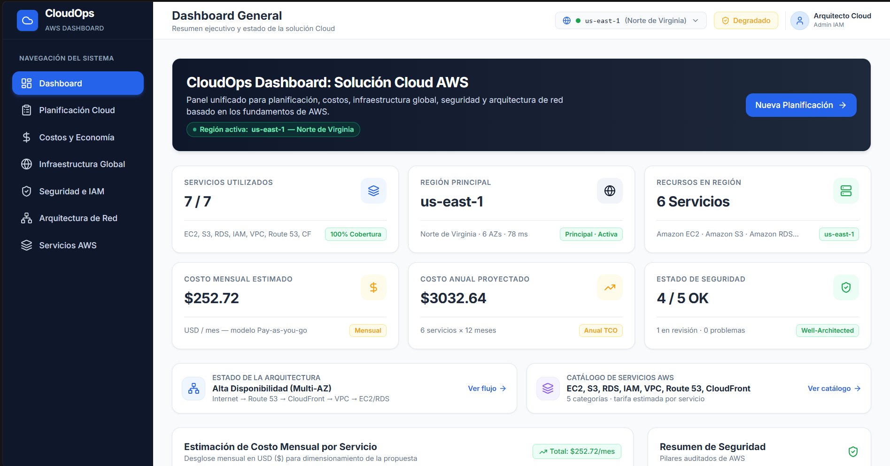
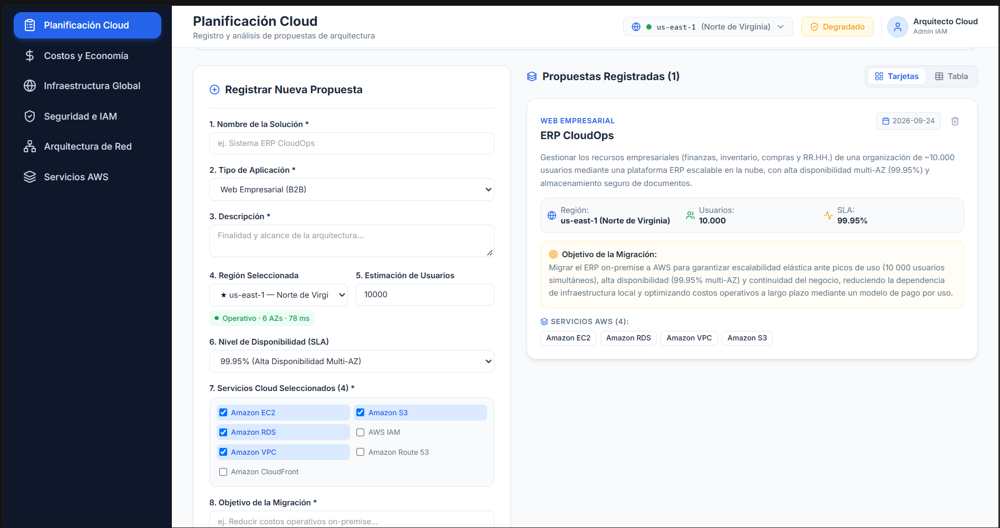
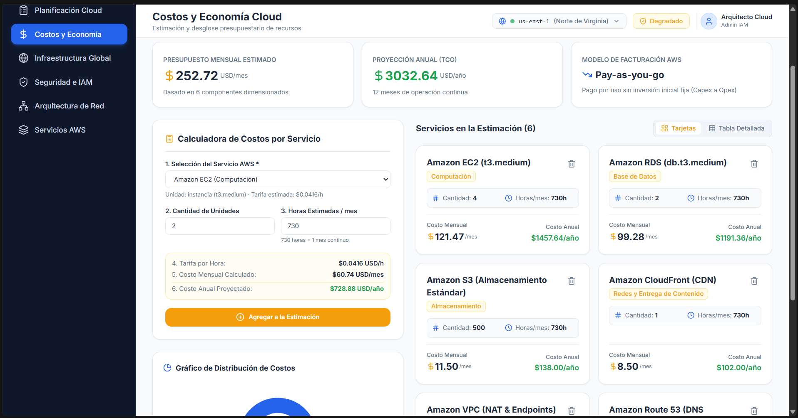
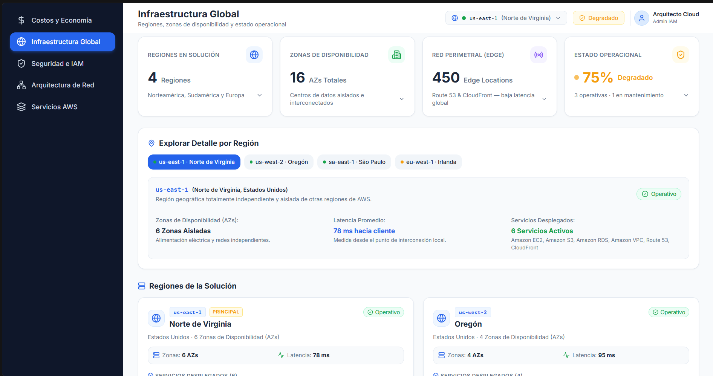
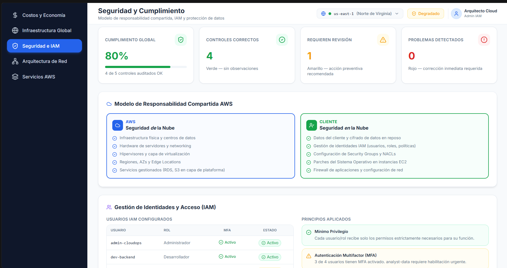
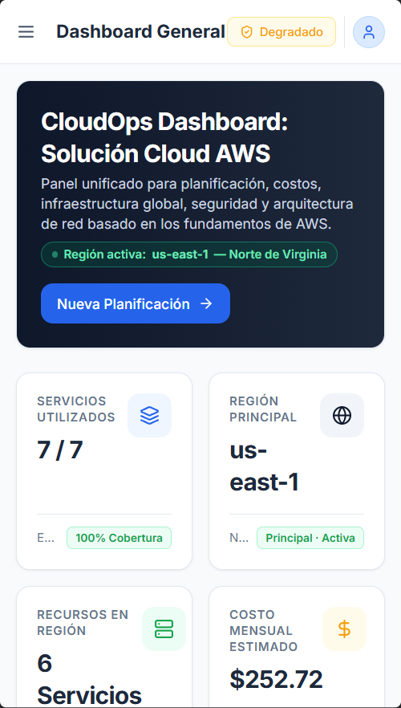

# CloudOps Dashboard

**Sistema web para la planificación y visualización de una solución Cloud**

> Práctica Integrativa — Cloud Foundations | Semanas 5 y 6  
> Tecnología principal: React + TypeScript + Tailwind CSS

---

## Descripción

CloudOps Dashboard es una aplicación web profesional desarrollada con React y TypeScript que simula un panel de planificación y análisis de infraestructura Cloud basado en los servicios de AWS.

La aplicación permite visualizar y analizar los componentes fundamentales de una solución de computación en la nube: planificación, estimación de costos, infraestructura global, seguridad e IAM, arquitectura de red y catálogo de servicios AWS.

> Los datos son simulados/estáticos. No requiere conexión a una cuenta real de AWS.

**Retos adicionales implementados:** Persistencia con `localStorage`, modo oscuro, notificaciones toast, selector global de regiones, buscador de servicios, filtros por categoría y vista detallada de cada servicio.

---

## Tecnologías utilizadas

| Tecnología | Versión | Uso |
|---|---|---|
| React | 18.3 | Biblioteca principal de UI |
| TypeScript | 5.5 | Tipado estático |
| Tailwind CSS | 3.4 | Estilos utilitarios + modo oscuro vía `darkMode: 'class'` |
| React Router DOM | 6.26 | Navegación SPA entre 7 módulos |
| Recharts | 2.12 | Gráficos de barras (BarChart) y torta (PieChart) |
| Lucide React | 0.441 | Iconografía consistente |
| Vite | 5.4 | Bundler y servidor de desarrollo |

---

## Instalación

### Requisitos previos

- Node.js 18 o superior
- npm 9 o superior

### Pasos

```bash
# 1. Clonar el repositorio
git clone https://github.com/tu-usuario/cloudops-dashboard.git
cd cloudops-dashboard

# 2. Instalar dependencias
npm install

# 3. Iniciar el servidor de desarrollo
npm run dev
```

La aplicación estará disponible en `http://localhost:5173`

---

## Scripts disponibles

```bash
npm run dev       # Servidor de desarrollo con hot reload
npm run build     # Compilar para producción (tsc + vite build)
npm run preview   # Previsualizar build de producción
```

---

## Estructura del proyecto

```
CloudOps-Dashboard-v1/
│
├── src/
│   ├── components/
│   │   ├── CostCard.tsx            # Tarjeta de ítem de costo (mensual + anual)
│   │   ├── Header.tsx              # Barra superior: título, selector de región, toggle dark/light, usuario
│   │   ├── RegionCard.tsx          # Tarjeta de región con AZs, latencia y servicios
│   │   ├── SecurityCard.tsx        # Tarjeta de pilar de seguridad con diagnóstico
│   │   ├── ServiceCard.tsx         # Tarjeta de servicio AWS (clickeable → abre modal)
│   │   ├── ServiceDetailModal.tsx  # Modal de vista detallada con casos de uso y modelo de precios
│   │   ├── Sidebar.tsx             # Navegación lateral con 7 NavLinks
│   │   ├── StatCard.tsx            # Tarjeta KPI con badge reactivo al tema
│   │   ├── StatusBadge.tsx         # Indicador semáforo verde/amarillo/rojo
│   │   └── ToastContainer.tsx      # Contenedor de notificaciones toast (esquina inferior derecha)
│   │
│   ├── context/
│   │   ├── CloudContext.tsx        # Estado global: proposals, costItems, región, costos, multiplicador
│   │   ├── ThemeContext.tsx        # Modo oscuro: isDark, toggleTheme, persistencia localStorage
│   │   └── ToastContext.tsx        # Notificaciones: addToast, removeToast, auto-dismiss 4s
│   │
│   ├── data/
│   │   └── awsServices.ts          # Todos los datos simulados:
│   │                               #   - AWS_SERVICES (7 servicios con tarifas)
│   │                               #   - GLOBAL_REGIONS (4 regiones con costMultiplier)
│   │                               #   - SECURITY_PILLARS (5 pilares auditados)
│   │                               #   - NETWORK_FLOW_COMPONENTS (6 capas de red)
│   │                               #   - INITIAL_PROPOSALS y INITIAL_COST_ITEMS
│   │
│   ├── pages/
│   │   ├── Dashboard.tsx           # Módulo 1: 6 KPIs + gráfico barras + resumen seguridad
│   │   ├── Planning.tsx            # Módulo 2: formulario 8 campos + tarjetas/tabla + eliminar
│   │   ├── Costs.tsx               # Módulo 3: calculadora + PieChart + tarjetas/tabla
│   │   ├── Infrastructure.tsx      # Módulo 4: 4 cards expandibles + selector región + RegionCards
│   │   ├── Security.tsx            # Módulo 5: KPIs + resp. compartida + IAM + pilares expandibles
│   │   ├── Network.tsx             # Módulo 6: diagrama INTERNET→RDS + panel detalles + tabla
│   │   └── Services.tsx            # Módulo 7: catálogo + buscador + filtros + modal detallado
│   │
│   ├── screenshots/
│   │   ├── dashboard.png
│   │   ├── planning.png
│   │   ├── costs.png
│   │   ├── infrastructure.png
│   │   ├── Security.png
│   │   ├── Network Architecture.png
│   │   ├── AWS Services.png
│   │   └── responsive.png
│   │
│   ├── types/
│   │   └── cloud.ts                # Interfaces TypeScript: AwsService, CloudProposal,
│   │                               # CostCalculationItem, GlobalRegion, SecurityPillar, NetworkComponent
│   │
│   ├── App.tsx                     # Raíz: ThemeProvider > ToastProvider > CloudProvider > BrowserRouter
│   ├── index.css                   # Variables CSS :root/.dark + .card-base + overrides para dark mode
│   └── main.tsx                    # Punto de entrada React
│
├── README.md
├── tailwind.config.js              # darkMode: 'class' + paleta de colores custom
├── tsconfig.json
├── vite.config.ts
├── package.json
└── vercel.json
```

---

## Flujo de estado global

```
ThemeProvider  ──── isDark, toggleTheme (localStorage: cloudops_theme)
  └── ToastProvider  ──── addToast, removeToast, auto-dismiss
        └── CloudProvider  ──── proposals, costItems, selectedRegion,
              │                 costMultiplier, totales (localStorage: 3 claves)
              └── BrowserRouter
                    ├── Header  ←── useCloud + useToast + useTheme
                    ├── Sidebar
                    └── Pages   ←── useCloud / datos estáticos según módulo
```

---

## Funcionalidades por módulo

### Módulo 1 — Dashboard (`/dashboard`)
- 6 tarjetas KPI: servicios activos, región activa, recursos en región, costo mensual, costo anual y estado de seguridad
- Región activa y costos se actualizan en tiempo real al cambiar región en el Header
- Gráfico de barras (Recharts) con distribución de costos mensuales por servicio
- Panel resumen de seguridad con semáforo correcto/revisión/problema y link a módulo Seguridad
- Accesos rápidos a Arquitectura de Red y Catálogo de Servicios

### Módulo 2 — Planificación Cloud (`/planning`)
- Formulario con los 8 campos requeridos: nombre, tipo, descripción, región, usuarios, SLA, servicios y objetivo
- Selector de región sincronizado con la región global del Header
- Banner de alerta si la región no es la principal (`us-east-1`) o está en mantenimiento
- Indicador de estado y multiplicador de costo por región debajo del selector
- Visualización de propuestas en **tarjetas** o **tabla** con toggle
- **Eliminar propuestas** con confirmación de doble clic (auto-cancela en 4 s) y toast de confirmación
- Estado vacío con mensaje guía cuando no hay propuestas
- Persistencia en `localStorage` — las propuestas sobreviven recargas

### Módulo 3 — Costos y Economía Cloud (`/costs`)
- Calculadora de costos Pay-as-you-go en tiempo real: servicio, cantidad y horas/mes
- Precios ajustados automáticamente por región activa (multiplicador regional)
- Aviso visual cuando la región encarece los costos respecto a `us-east-1`
- Tarifa/hora, costo mensual y costo anual mostrados en vivo antes de agregar
- Gráfico de torta donut (Recharts) con distribución por categoría de servicio
- Vista de ítems como **tarjetas** o **tabla detallada** con fila de totales
- Eliminar ítems individuales de la estimación
- Persistencia en `localStorage`

### Módulo 4 — Infraestructura Global (`/infrastructure`)
- 4 tarjetas métricas clickeables que expanden paneles de detalle:
  - **Regiones**: mini-cards con código, estado, AZs y latencia por región
  - **AZs**: barra visual por región coloreada según estado operacional
  - **Red Perimetral**: descripción técnica de Route 53 y CloudFront con SLA badges
  - **Estado Operacional**: lista de regiones con indicadores y alerta si hay mantenimiento
- Estado operacional calculado dinámicamente (no hardcodeado): `eu-west-1` en Mantenimiento → 75%
- Selector de región interactivo con panel de detalle técnico (AZs, latencia, servicios)
- Grid de `RegionCard` para las 4 regiones; `us-east-1` marcada como Principal
- Sección informativa de los 3 pilares de la infraestructura global AWS

### Módulo 5 — Seguridad e IAM (`/security`)
- 4 KPIs semáforo: cumplimiento global (%) con barra de progreso, controles correctos, en revisión y problemas
- Diagrama visual del **Modelo de Responsabilidad Compartida**: AWS (seguridad *de* la nube) vs Cliente (seguridad *en* la nube)
- Tabla de 4 usuarios IAM configurados con columnas: usuario, rol, estado de MFA, estado general
- Principios IAM aplicados: mínimo privilegio, MFA, rotación de credenciales y roles vs usuarios
- 5 pilares de seguridad con filtro por estado (Todos / Correcto / Revisión / Problema)
- Cada pilar es expandible y muestra el `SecurityCard` con diagnóstico y desglose de responsabilidades

### Módulo 6 — Arquitectura de Red (`/network`)
- Diagrama interactivo construido en HTML/CSS Tailwind — no es una imagen pegada
- Flujo completo: **INTERNET → Route 53 → CloudFront → VPC → EC2 → RDS**
- Zona Edge (fondo gris punteado) y Zona VPC (borde ámbar punteado) visualmente diferenciadas
- Cada capa es clickeable y muestra panel lateral con: descripción, CIDR/Endpoint, Security Group y capa
- Nota de seguridad: "Network ACLs + Security Groups — Sin acceso directo a subnets privadas"
- Lista rápida de componentes en el panel lateral para navegación directa
- Tabla resumen del flujo completo con paso, componente, capa, CIDR y Security Group
- Leyenda de conceptos clave (Route 53, CloudFront, VPC, EC2, RDS Multi-AZ)

### Módulo 7 — Servicios AWS (`/services`)
- Catálogo con los 7 servicios mínimos requeridos: EC2, S3, RDS, IAM, VPC, Route 53, CloudFront
- Cada `ServiceCard` muestra: nombre, categoría con ícono, descripción, función principal y tarifa
- **Buscador en tiempo real** por nombre, categoría, descripción o función (con `useMemo`)
- **Filtros por categoría** como pills coloreados con conteo de servicios por categoría
- Estado vacío con botón de limpieza de filtros
- **Vista detallada** al hacer clic en cualquier tarjeta: modal con casos de uso, características clave y modelo de precios real de AWS

---

## Paleta de colores

| Elemento | Color |
|---|---|
| Fondo principal | `#F8FAFC` |
| Sidebar | `#0F172A` |
| Color principal | `#2563EB` |
| Seguridad | `#16A34A` |
| Costos | `#F59E0B` |
| Alertas | `#DC2626` |
| Texto principal | `#1E293B` |
| Texto secundario | `#64748B` |
| Bordes | `#E2E8F0` |
| Cards | `#FFFFFF` |

---

## Navegación

| Ruta | Módulo |
|---|---|
| `/dashboard` | Panel principal |
| `/planning` | Planificación Cloud |
| `/costs` | Costos y Economía |
| `/infrastructure` | Infraestructura Global |
| `/security` | Seguridad e IAM |
| `/network` | Arquitectura de Red |
| `/services` | Catálogo de Servicios AWS |

---

## Retos adicionales implementados

### 1. Persistencia con localStorage

| Clave | Datos | Cuándo se actualiza |
|---|---|---|
| `cloudops_proposals` | Propuestas Cloud registradas | Al agregar o eliminar |
| `cloudops_cost_items` | Ítems de estimación de costos | Al agregar o eliminar |
| `cloudops_selected_region` | Región activa del Header | Al cambiar de región |
| `cloudops_theme` | Preferencia dark/light | Al hacer toggle |

Inicialización lazy, fallback seguro si los datos están corruptos, sincronización automática con `useEffect`.

```js

localStorage.removeItem('cloudops_proposals');
localStorage.removeItem('cloudops_cost_items');
localStorage.removeItem('cloudops_selected_region');
localStorage.removeItem('cloudops_theme');
```

### 2. Modo oscuro

Toggle Sol/Luna en el Header. Respeta `prefers-color-scheme` del sistema operativo si no hay preferencia guardada. Implementado con variables CSS en `:root` y `.dark`, clase `dark` en `<html>` controlada por `ThemeContext`. Los componentes `StatCard` y `StatusBadge` usan `useTheme()` para estilos de badge completamente reactivos.

### 3. Notificaciones toast

Sistema con 4 tipos (success / warning / error / info). Aparecen en la esquina inferior derecha, con auto-dismiss en 4 segundos y botón de cierre manual. Disparadas en:
- Registrar una propuesta Cloud
- Eliminar una propuesta Cloud
- Agregar una estimación de costo
- Cambiar la región activa

### 4. Selector global de regiones

Dropdown en el Header con las 4 regiones AWS. Al seleccionar una región toda la app reacciona: KPIs del Dashboard, costos ajustados, avisos en Planificación y Costos, y estado del sistema en el Header.

### 5. Buscador de servicios

Búsqueda en tiempo real en `/services` usando `useMemo`. Filtra por nombre, categoría, descripción y función principal simultáneamente.

### 6. Filtros por categoría

5 pills de filtro coloreados (Computación, Almacenamiento, Base de Datos, Seguridad, Redes) con conteo de servicios por categoría. Compatible con el buscador.

### 7. Vista detallada de cada servicio

Modal accesible al hacer clic en cualquier `ServiceCard`. Incluye: casos de uso principales, características clave y modelo de precios real de AWS para cada servicio. Se cierra con Escape, clic en el overlay o botón Cerrar.

---

## Conceptos Cloud aplicados

- **Modelo de Responsabilidad Compartida**: diferenciación seguridad *de* la nube (AWS) vs seguridad *en* la nube (Cliente)
- **IAM**: usuarios, roles, políticas de mínimo privilegio y autenticación multifactor (MFA)
- **Regiones y AZs**: 4 regiones globales con zonas de disponibilidad independientes y estado operacional real
- **VPC**: red virtual con subredes públicas/privadas, NACLs y Security Groups
- **Economía Cloud**: modelo Pay-as-you-go, TCO, Capex a Opex, Savings Plans, multiplicadores de precio por región
- **Arquitectura de red**: Route 53 → CloudFront → VPC → EC2/RDS con defensa en profundidad

---

## Capturas de pantalla

### Dashboard


### Planificación Cloud


### Costos y Economía Cloud


### Infraestructura Global


### Seguridad e IAM


### Arquitectura de Red


### Servicios AWS


### Vista Responsive (móvil)


---

## Guía de demostración

### 1. Problema
Una empresa de desarrollo necesita evaluar una arquitectura Cloud antes de implementarla en AWS. Sin herramientas de planificación visuales, es difícil dimensionar costos, regiones y seguridad de forma anticipada.

### 2. Solución implementada
CloudOps Dashboard centraliza la planificación Cloud en una sola interfaz: permite registrar propuestas, simular costos por región, visualizar la infraestructura global, auditar seguridad y representar la arquitectura de red, todo sin necesitar una cuenta real de AWS.

### 3. Arquitectura de la aplicación
- **React + TypeScript** como base de la SPA
- **React Router DOM** para navegación entre 7 módulos sin recarga de página
- **Context API** con 3 contextos independientes (Cloud, Theme, Toast)
- **localStorage** para persistencia de 4 claves entre sesiones del navegador
- **Recharts** para visualización de datos (BarChart y PieChart)
- **Tailwind CSS** con `darkMode: 'class'` y variables CSS para diseño responsivo y modo oscuro

### 4. Conceptos Cloud demostrados

| Concepto | Dónde se ve en la app |
|---|---|
| Regiones y AZs | Infraestructura → cards expandibles con barra visual de AZs por estado |
| Economía Cloud (Pay-as-you-go) | Costos → calculadora con multiplicador regional real |
| Responsabilidad Compartida | Seguridad → diagrama visual AWS vs Cliente |
| IAM | Seguridad → tabla de usuarios con MFA, roles y principios |
| VPC y arquitectura de red | Red → diagrama interactivo INTERNET → EC2/RDS con Security Groups |
| Planificación Cloud | Planificación → formulario con SLA, servicios seleccionables y objetivo |

### 5. Decisiones de diseño
- **Paleta exacta del documento**: todos los colores del spec académico (`#2563EB`, `#0F172A`, `#16A34A`, etc.) aplicados al pie de la letra
- **10 componentes reutilizables**: usados en múltiples páginas para consistencia visual
- **Estado operacional realista**: `eu-west-1` en Mantenimiento hace que el sistema muestre 75% (no 100%) con avisos contextuales en toda la app
- **Costos por región**: multiplicadores basados en tarifas reales de AWS (São Paulo +50%, Irlanda +18%)
- **Confirmación en dos pasos**: protege contra eliminaciones accidentales sin bloquear el flujo

---

## Autor

Desarrollado como práctica integrativa del curso **Cloud Foundations** — Semanas 5 y 6.
